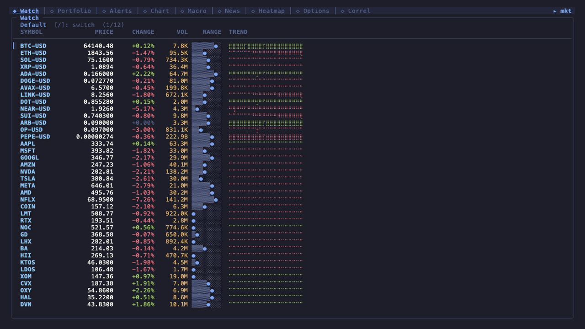

# mkt

Real-time stock and crypto market dashboard for the terminal — single binary, no API keys.

Crypto prices stream live via Coinbase WebSocket. Stock quotes poll from Yahoo Finance. Nine tabs: watchlist with sparklines, portfolio P&L, price alerts with desktop notifications, candlestick/line charts with 13 technical indicators, macro dashboard, news feed, sector heatmap, options chain, and a correlation matrix. 7 color themes.

Built with Go, [Bubbletea v2](https://charm.land/bubbletea), and [Lipgloss v2](https://charm.land/lipgloss).



---

## Installation

### Download a release binary

Every tag publishes signed `tar.gz` / `zip` archives for **linux, darwin and windows × amd64 and arm64**, plus a `checksums.txt`, a cosign signature over it, and a per-archive SBOM — see [Releases](https://github.com/stxkxs/mkt/releases).

```sh
VERSION=0.1.0            # without the leading v
OS=darwin ARCH=arm64     # linux|darwin|windows × amd64|arm64
BASE=https://github.com/stxkxs/mkt/releases/download/v$VERSION

curl -sSLO $BASE/mkt_${VERSION}_${OS}_${ARCH}.tar.gz
curl -sSLO $BASE/checksums.txt
sha256sum --ignore-missing -c checksums.txt   # macOS: shasum -a 256 -c checksums.txt --ignore-missing

tar xzf mkt_${VERSION}_${OS}_${ARCH}.tar.gz
sudo install -m755 mkt /usr/local/bin/mkt
```

The checksums file is signed keyless (Sigstore/OIDC) by the release workflow. To verify the signature rather than just the digest:

```sh
curl -sSLO $BASE/checksums.txt.sig
curl -sSLO $BASE/checksums.txt.pem

cosign verify-blob checksums.txt \
  --certificate checksums.txt.pem \
  --signature checksums.txt.sig \
  --certificate-identity-regexp '^https://github.com/stxkxs/mkt/\.github/workflows/release\.yml@refs/tags/v' \
  --certificate-oidc-issuer https://token.actions.githubusercontent.com
```

There is no Homebrew tap yet — publishing one needs a cross-repo push token the release workflow deliberately does not carry.

### go install

```sh
go install github.com/stxkxs/mkt@latest
```

`go install` builds without release ldflags, so `mkt version` reports `dev`.

### Build from source

Requires Go 1.25+ and [Task](https://taskfile.dev) (`brew install go-task` or `go install github.com/go-task/task/v3/cmd/task@latest`).

```sh
git clone https://github.com/stxkxs/mkt.git
cd mkt
task build    # or: go build -o mkt .
./mkt
```

---

## Usage

```sh
mkt                             # launch TUI dashboard
mkt serve                       # serve the dashboard over SSH to authorized keys
mkt watch BTC-USD ETH-USD AAPL  # stream prices to stdout (no TUI)
mkt daemon                      # headless: full data plane + alerts + notifiers, no TUI
mkt mcp                         # Model Context Protocol server over stdio
mkt backtest rules.yaml replay.ndjson   # replay an alert ruleset against a recorded stream
mkt config show                 # view configuration
mkt config add TSLA LINK-USD    # add symbols to watchlist
mkt config remove DOGE-USD      # remove a symbol
mkt config set poll_interval 30s
mkt config validate             # check config for invalid values
mkt config repair --list        # list timestamped config backups; restore with --from-backup N
mkt portfolio import --portfolio Tech schwab-export.csv   # import broker CSV
mkt portfolio stats             # Sharpe / Sortino / max drawdown / CAGR / beta from the equity curve
mkt position --equity 100000 --risk 1 --entry 50 --stop 48 # share-sizing calc
mkt version
```

### Flags

Seven flags are **persistent** — they parse on every subcommand — but only `mkt`, `mkt serve` and `mkt daemon` act on them. The other subcommands accept and ignore them.

| Flag | Env | What it does |
|---|---|---|
| `--listen <addr>` | `MKT_LISTEN` | start a read-only HTTP server exposing `/quotes`, `/quotes/{symbol}`, `/alerts` and `/metrics`. |
| `--listen-token <token>` | `MKT_LISTEN_TOKEN` | require `Authorization: Bearer <token>` (header only; query-string tokens are rejected so secrets don't leak into logs) on every HTTP request. Passing it on argv warns, because argv is world-readable via `ps`. |
| `--listen-token-file <path>` | `MKT_LISTEN_TOKEN_FILE` | read the token from a file's first line instead, keeping it off argv. |
| `--require-token` | — | require a token even on a loopback bind. |
| `--enable-webhook` | — | additionally mount `POST /webhook/tradingview`. Off by default; requires a listen token **even on loopback**. |
| `--no-desktop-notify` | — | suppress the desktop popup + terminal bell (already off under `mkt serve`). |
| `--no-notify` | — | suppress every notifier — desktop, webhook, ntfy, Pushover. Rules still evaluate and alert history still records. |

Token precedence is `--listen-token` > `--listen-token-file` > `MKT_LISTEN_TOKEN_FILE` > `MKT_LISTEN_TOKEN`.

A token **is mandatory for any non-loopback bind**: a loopback bind (`127.0.0.1:9999`) may omit it, but `mkt` **refuses to start** on any other address (including the all-interfaces form `:9999` / `0.0.0.0`) without one, since `/alerts` names your configured destinations. `--enable-webhook` demands a token unconditionally — even on loopback — because `/webhook/tradingview` can inject alerts; it is also rate-limited to guard against notification spam.

Non-persistent flags:

- `--force` on `mkt`, `mkt serve`, `mkt daemon` — start *and keep writing config* even when `config.yaml` does not parse. See [Config write safety](#config-write-safety).
- `--persist-alerts` on `mkt serve` — let SSH sessions write alerts they create/toggle/delete back to the host's config. Off by default: a guest must not rewrite the host's config.
- `--force` / `--yes` (`-y`) on `mkt config …` and `mkt portfolio …` — see [Config write safety](#config-write-safety).

Record a live quote stream for later backtesting: `MKT_RECORD=session.ndjson mkt`. Replay it: `mkt backtest rules.yaml session.ndjson`. An existing capture at that path is preserved as `session.ndjson.bak.<timestamp>` (newest 10 kept) rather than truncated.

Import supports two CSV formats (auto-detected from the header):

- **generic** — `date,type,symbol,quantity,price,fee,note` where `type` is `buy|sell|dividend`
- **schwab** — Charles Schwab transaction export (Buy / Sell / Reinvest Dividend)

`--dry-run` parses and prints a summary without modifying the config; `--format` overrides auto-detect. Re-importing the same file is a no-op — a transaction already present in the destination portfolio (same date, type, symbol, quantity and price) is skipped. Genuine same-day repeats survive: matching is by count, so two identical CSV rows still import as two. `--force` appends everything regardless (and also authorizes a write over a config that does not parse).

### TUI Keybindings

Press `?` at any time for the active tab's keys.

**Global** (every tab)

| Key | Action |
|-----|--------|
| `1`–`9` | Jump to tab (Watch, Portfolio, Alerts, Chart, Macro, News, Heatmap, Options, Correl) |
| `tab` / `→` , `shift+tab` / `←` | Next / previous tab |
| `:` | Command palette (tab-name prefix, `theme <name>`, or `q`) |
| `T` | Cycle color theme |
| `?` | Keybinding help for the active tab |
| `q` / `ctrl+c` | Quit |

**Watch**

| Key | Action |
|-----|--------|
| `j` / `k`, `↑` / `↓` | Navigate rows |
| `g` / `G` | First / last row |
| `/` | Fuzzy-search symbols (`enter` jumps, `esc` cancels, `ctrl+n`/`ctrl+p` move) |
| `s` | Cycle sort (config order → change% → volume → price) |
| `[` / `]` | Switch watchlist group |
| `enter` | Open the detail panel (quote, sparkline, notes, live order book for crypto) |
| `c` | Full-screen chart for the selected symbol |
| `a` | Add the selected symbol to the comparison set |
| `C` | Open the multi-symbol comparison chart |
| `A` | Create an alert on the selected symbol |
| `i` | Symbol info overlay |
| `O` | Load the options chain (switches to the Options tab) |

**Chart** (full-screen, opened with `c`)

| Key | Action |
|-----|--------|
| `[` / `]` | Change interval (1m, 5m, 15m, 1h, 4h, 1d, 1w — 1d by default) |
| `+` / `-` | Zoom in / out |
| `f` | Restore auto-fit zoom (refit the window to the terminal width) |
| `m` | Toggle candlestick / line |
| `i` | Indicator menu — `1`–`9`, `a`, `p`, `v`, `k` toggle SMA / EMA / Bollinger / RSI / MACD / VWAP / OBV / ATR / Stoch / ADX / Pivots / VolProfile / Patterns |
| mouse | Move for a crosshair; wheel to zoom |
| `esc` | Close the chart |

The comparison chart (`C`) shares `[` / `]`, `+` / `-`, `f` and `esc`, and adds `x` to drop the most recently added symbol.

**Portfolio** — `j` / `k` navigate holdings, `[` / `]` switch portfolio.

**Alerts** — `j` / `k` navigate, `t` toggle a rule on/off, `d` (or `delete`) delete a rule; the next key confirms (`y` deletes, anything else cancels, and `q` does not quit while the prompt is up).

**Macro** — `j` / `k`, `↑` / `↓`, `pgup` / `pgdn`, `g` / `G` and the mouse wheel scroll.

**News** — `j` / `k`, `g` / `G` navigate, `f` cycles the filter (All / News / Filings), `enter` opens the headline in your browser.

**Heatmap** — `j` / `k` / `h` / `l` navigate sectors, `enter` drills into a sector, `esc` returns. Clicking a sector selects it; clicking it again drills in; clicking a ticker tile inside a sector opens its chart.

**Options** — `j` / `k` scroll the chain. Load one with `O` from the Watch tab.

**Correl** — `j` / `l` / `]` / `↓` and `k` / `h` / `[` / `↑` scroll the visible symbol window, `pgup` / `pgdn` scroll by a page, `g` / `G` jump to the first / last symbols, `b` cycles the resampling bucket (30s → 1m → 5m → 15m).

`esc` closes whatever is on top — detail panel, full-screen chart, comparison chart, or a modal overlay.

### Watchlist Tab

Live prices with 24h change, volume, and sparkline trend for each symbol. Crypto updates in real-time via WebSocket; stocks poll at a configurable interval (default 15s). Sparklines are backfilled from daily history at startup, so they are populated on the first frame rather than filling in over the next hour.

Symbols are canonicalized on the way in: `btc`, `BTC-USD` and `BTCUSDT` are all the same row, `aapl` becomes `AAPL`, and `MATIC` follows the ticker migration to `POL`. A symbol no provider can serve is named on stderr at startup and flagged in the TUI rather than silently never pricing.

### Portfolio Tab

Track holdings with live unrealized P&L across multiple thematic portfolios. Switch portfolios with `[` / `]`. Configure positions in `~/.config/mkt/config.yaml`.

Every holding and transaction symbol is subscribed whether or not it is on a watchlist, so `mkt portfolio import` alone is enough to get live prices.

Totals cover **priced holdings only**. A holding with no quote is not folded in at break-even; instead the header says so:

```
  Value: $128,441.02   P&L: +$9,204.51 (+7.7%)
  2 of 19 holdings not quoted (PRIVCO, DELISTED) — totals cover 91% of cost basis
```

`mkt portfolio stats` reports the same portfolio's Sharpe, Sortino, max drawdown, volatility, CAGR and beta from the recorded equity curve (`--rf` sets the risk-free rate per mark interval, `--benchmark` the beta reference, default `SPY`, empty string skips the fetch). Annualized figures derived from less than a week of marks are labelled as extrapolations rather than presented as fact.

### Alerts Tab

Set price alerts that fire desktop notifications:

```yaml
alerts:
  - symbol: BTC-USD
    condition: above    # above, below, pct_up, pct_down, rsi_above, rsi_below,
    value: 100000       # sma_cross_above, sma_cross_below, macd_cross,
    enabled: true       # volume_above, stddev_above
```

`volume_above` triggers when the quote's reported volume exceeds the value. `stddev_above` triggers when the rolling standard deviation over `period` quotes exceeds `value` percent of the rolling mean — a volatility expansion proxy when full OHLC isn't available.

**Alerts are edge-triggered.** A level condition (`above`, `below`, `pct_up`, `pct_down`, `rsi_above`, `rsi_below`, `volume_above`, `stddev_above`) fires on the *transition into* the condition, not on every quote while it happens to be true. The cross conditions (`sma_cross_above`, `sma_cross_below`, `macd_cross`) were always edge-triggered by construction.

**The first evaluation after startup establishes a baseline and does not fire.** A rule that is already breached when `mkt` launches stays quiet until it un-breaches and re-breaches. This is what stops a fresh install from spraying a notification for every seeded alert that happens to be true at that moment.

On top of that, each rule has a 5-minute cooldown, and notifiers are rate-limited to ~20/min each.

Alerts created, toggled or deleted in the TUI now **persist** to `~/.config/mkt/config.yaml` (coalesced with a 2s debounce, timestamped backup per write). Two exceptions: under `mkt serve` persistence is off unless you pass `--persist-alerts` (a guest must not rewrite the host's config), and it is off entirely while the config file is degraded.

Compound rules combine multiple conditions with `match: all`, `match: any`, or `match: sequence` (in declared order):

```yaml
alerts:
  - symbol: BTC-USD
    enabled: true
    match: all                       # every sub-condition must fire
    conditions:
      - condition: above
        value: 100000
      - condition: rsi_above
        value: 70

  - symbol: ETH-USD
    enabled: true
    match: sequence                  # first crossed up, then dropped
    conditions:
      - condition: above
        value: 3500
      - condition: below
        value: 3300
```

Alerts can also POST a JSON payload to a webhook on every trigger — useful for Slack/Discord/IFTTT or any custom receiver. Set a default URL at the top level and/or override per rule:

```yaml
webhook_url: https://hooks.slack.com/services/...   # default destination (optional)

alerts:
  - symbol: BTC-USD
    condition: above
    value: 100000
    enabled: true
    webhooks:                                       # per-rule override (optional)
      - https://discord.com/api/webhooks/...
```

The payload is `{symbol, condition, value, price, message, timestamp}`.

For mobile push, configure ntfy.sh (no signup) and/or Pushover (free dev account):

```yaml
ntfy_topic: mkt-alerts-<your-unique-string>   # subscribe in the ntfy app
# ntfy_server: https://ntfy.sh                # optional override

pushover_user: u-...                          # your Pushover user key
pushover_token: a-...                         # your Pushover application token
```

### Charts

Press `c` on any symbol for a full-screen candlestick or line chart. Press `i` to overlay technical indicators:

- **SMA(20)** / **EMA(20)** — moving average lines on the price axis
- **Bollinger Bands** — upper/middle/lower bands on the price axis
- **VWAP** — anchored volume-weighted average price overlay on the price axis
- **RSI(14)** — relative strength index in a sub-panel (0–100, ref lines at 30/70)
- **MACD(12,26,9)** — MACD line, signal line, and histogram in a sub-panel
- **OBV** — on-balance volume in a sub-panel (running signed-volume total)
- **ATR(14)** — Wilder-smoothed Average True Range in a sub-panel
- **Stochastic(14,3)** — %K and %D oscillator in a sub-panel (ref lines at 20/80)
- **ADX(14)** — trend strength with +DI/-DI in a sub-panel (ref line at 25)
- **Pivots** — classic floor-trader pivot lines (P, R1-R3, S1-S3) overlaid on the main chart from the prior session's HLC
- **Volume Profile** — horizontal volume histogram in a right-side gutter; point-of-control row highlighted
- **Candle Patterns** — Doji, Hammer, Shooting Star, Bullish/Bearish Engulfing marked with glyphs on the candlestick chart

Multiple indicators can be active simultaneously.

### Comparison Chart

From the watchlist, press `a` on up to 3 symbols to add them to a comparison set, then `C` to open. Prices are normalized to % change from the first visible candle. Each symbol gets a distinct color.

### Macro Dashboard

Fixed set of macro indicators updated on the same poll interval: 10Y Treasury, 13W T-Bill, VIX, Dollar (DXY), Gold, WTI Crude, S&P 500, and Bitcoin. Below them: a computed **10Y-3M yield spread** (`^TNX - ^IRX` — `^IRX` is the 13-week bill, so this is the 10Y-3M curve, not the 2s10s), Crypto Futures, Upcoming Economic Events (30d), and DeFi TVL. The tab scrolls with `j` / `k`, `pgup` / `pgdn`, `g` / `G` and the wheel.

### News Feed

Aggregated RSS headlines from Yahoo Finance, MarketWatch, and CNBC. Polls every 3 minutes. Press `enter` to open a headline in your browser.

Optionally, add SEC EDGAR per-ticker filings into the same feed via `edgar_tickers` in config:

```yaml
edgar_tickers: [AAPL, NVDA, TSLA]
```

Filings appear with source `SEC:<TICKER>` and a category (8-K, 10-Q, etc.). Press `f` in the News tab to cycle the filter: All / News / Filings.

### Sector Heatmap

Treemap overview colored by average daily change (red → green gradient). **One tile per watchlist group** — the heatmap draws your own `watchlists:` (11 groups on a fresh install), so every tile is a symbol the hub is actually subscribed to. Press `enter` to drill down into a sector and see individual stock tiles sorted by performance with price, change%, volume, and colored bars. Press `esc` to return to the overview.

### Correlation Matrix

Pairwise Pearson correlation of **log returns** across the whole watchlist universe (canonicalized and de-duplicated, so `btc`, `BTC-USD` and `BTCUSDT` produce one row rather than three). Because Coinbase streams tick-by-tick and Yahoo polls every 15s, both series are resampled onto a common bucket before the returns are computed — press `b` to cycle 30s → 1m → 5m → 15m.

### Themes

Press `T` to cycle through 7 color themes: Tokyonight (default), Catppuccin Mocha, Gruvbox Dark, Nord, Dracula, Solarized Dark, and Catppuccin Latte (light). Theme choice persists in config.

---

## Configuration

Config lives at `~/.config/mkt/config.yaml` (mode `0600`, in a `0700` directory — it holds your holdings and any webhook/ntfy/Pushover secrets) and is seeded on first run with 11 thematic watchlists, 12 thematic portfolios and 11 example alerts.

Set `MKT_CONFIG_DIR` to keep it somewhere else — a synced folder, an encrypted volume, or a throwaway directory when you want to try something without touching your real setup. It overrides the home-directory lookup entirely, so it works the same on Linux, macOS and Windows:

```sh
MKT_CONFIG_DIR=/path/to/dir mkt          # config, backups, alert + equity history all live there
```

The shape, trimmed (`mkt config show` prints the real thing):

```yaml
watchlist:            # legacy flat list, still honored — appears as group "Default"
  - BTC-USD
  - AAPL
watchlists:           # named groups, cycled with [ / ] on the Watch tab
  - name: Crypto Majors
    symbols: [BTC-USD, ETH-USD, SOL-USD]
portfolios:
  - name: AI / Compute Buildout
    tax_method: fifo                      # fifo | lifo | hifo | "" (weighted average)
    holdings: [{symbol: NVDA, name: NVIDIA, quantity: 20, cost_basis: 475}]
    transactions: []                      # optional; folds into derived holdings
alerts: []
notes:                # free text shown in the detail panel
  NVDA: "trim above 200"
edgar_tickers: [AAPL, NVDA]
poll_interval: 15s
sparkline_len: 60
theme: tokyonight
```

`mkt config validate` checks the file for anything the dashboard would otherwise silently ignore: a file that does not parse, malformed durations, unknown themes, unknown alert conditions, bad tax methods, malformed transactions, non-canonical symbol spellings, and symbols that route to no provider. It exits non-zero on any finding. `--check-symbols` additionally asks each provider for one bar per configured symbol, which is the only way to catch a typo like `APPL` — it routes cleanly to Yahoo and is shaped exactly like a real ticker.

### Config write safety

`mkt` never destroys config data silently. Three rules cover every write, from `mkt config set` to an alert you toggle in the TUI:

**1. Every write that changes the file takes a timestamped backup first.**

```
$ mkt config remove TSLA -y
  ✓ backed up → ~/.config/mkt/config.yaml.bak.20260801-132521

  ⚠  this write removed data from your config:
       - 1 watchlist symbol (TSLA)

     Recover it with: mkt config repair --from-backup 1

  ✓ removed TSLA
```

Backups live beside the config as `config.yaml.bak.YYYYMMDD-HHMMSS`; the newest **10** are kept.

**2. A write that drops data asks first, and says exactly what would be lost.**

```
$ mkt config remove TSLA
mkt: this write drops data that is in ~/.config/mkt/config.yaml:
  - 1 watchlist symbol (TSLA)
A timestamped backup is written first.
Continue? [y/N]:
```

`--yes` / `-y` skips the prompt so the commands stay scriptable; `--force` implies `--yes`. Both are available on `mkt config …` and `mkt portfolio …`. With no terminal to prompt on (a pipe, a cron job) the write is **refused**, not silently accepted:

```
  ⚠  This write would remove data from your config:
       - 1 watchlist symbol (ZZZZ)

     Cause: this write drops data and there is no terminal to confirm on.

  Your file has NOT been modified.
  Re-run with --yes to write anyway (a timestamped backup is taken first).
```

**3. A config that does not parse does not stop the dashboard — but it does lock writes.**

`mkt` starts on built-in defaults, prints the file, line and parse error on stderr, and shows a **persistent banner** under the tab bar on every tab:

```
⚠ config.yaml:9 failed to parse — running on defaults. Config writes are disabled until fixed.
```

Every write is refused while the file is in that state, because writing would replace your real settings with the defaults `mkt` fell back to:

```
$ mkt config add TSLA

  ⚠  This write would remove data from your config:
       - everything in ~/.config/mkt/config.yaml — the file does not parse, so its contents cannot be read

     Cause: config.yaml failed to parse (line 6)
            mapping values are not allowed in this context
            so mkt loaded defaults instead of your file.

  Your file has NOT been modified.
  Fix line 6, or re-run with --force to overwrite.
  To recover an earlier copy: mkt config repair --list
```

`--force` re-enables writes (still backing up first, still reporting what was lost). On `mkt`, `mkt serve` and `mkt daemon` it also re-enables alert persistence and drops the "writes are disabled" half of the banner.

**Recovery — `mkt config repair`:**

```
$ mkt config repair --list
#    TAKEN                    AGE     SIZE  PATH
1    2026-08-01 13:25:05       0s     101B  ~/.config/mkt/config.yaml.bak.20260801-132505

Restore with: mkt config repair --from-backup 1

$ mkt config repair --from-backup 1
  ✓ backed up → ~/.config/mkt/config.yaml.bak.20260801-132505-1
  ✓ restored config from ~/.config/mkt/config.yaml.bak.20260801-132505
```

`--from-backup` takes either the 1-based index from `--list` or a path. Restoring is not a one-way door: the file being replaced is itself backed up first. If the restored file still doesn't parse, `repair` says so and exits non-zero.

---

## Data Sources

| Source | Protocol | Data | Auth |
|--------|----------|------|------|
| [Coinbase Advanced Trade](https://docs.cdp.coinbase.com/advanced-trade-api/docs/ws-overview) | WebSocket | Real-time crypto prices, level-2 order book | None |
| [Coinbase Exchange](https://docs.cloud.coinbase.com/exchange/reference/exchangerestapi_getproductcandles) | REST | Historical crypto candles, REST order-book snapshot | None |
| [Yahoo Finance](https://finance.yahoo.com) | REST (polling) | Stock quotes, history, macro indicators, options chains, earnings calendar | None (session cookies) |
| [FRED](https://fred.stlouisfed.org/) (St. Louis Fed) | REST (CSV) | Economic series (DFF, T10Y2Y, UNRATE, CPIAUCSL, …) via `FRED:` prefix | None |
| [DeFiLlama](https://defillama.com/) | REST | Per-chain TVL | None |
| [Binance Futures](https://binance-docs.github.io/apidocs/futures/) | REST | Funding rate + open interest (BTC/ETH/SOL perps) | None — **but see below** |
| Yahoo Finance / MarketWatch / CNBC | RSS | News headlines | None |
| [SEC EDGAR](https://www.sec.gov/cgi-bin/browse-edgar) | Atom (RSS) | Per-ticker filings (8-K, 10-Q, 10-K) | None |

No API keys required. Crypto streams from Coinbase (US-native, no geo-restrictions). Stock data polls from Yahoo Finance.

> **`fapi.binance.com` returns HTTP 451 from US IP addresses.** The Macro tab's *Crypto Futures* panel (mark price, funding rate, open interest) is therefore unavailable on a US host. It used to render as legitimate-looking `0.00` values; the rows now read `BTCUSDT   — unavailable in this region` rather than presenting a zero as a price. Turn the egress off entirely with `providers: { binance: false }`.

---

## Integrations

`mkt` is both a TUI *and* a headless data source, so it drops into the terminal ecosystem two ways: **hosts** run its TUI, and **consumers** read its data over MCP, HTTP, or a Prometheus scrape. Almost everything below is config-only — no rebuild.

### Serve over SSH (`mkt serve`)

Run the dashboard as a [Charm Wish](https://github.com/charmbracelet/wish) SSH app: every connection gets its own live, per-session dashboard driven by one shared data plane. Access is gated by a **public-key allowlist** — `mkt serve` refuses to start with an empty allowlist rather than expose your holdings.

```yaml
# ~/.config/mkt/config.yaml
serve:
  addr: "0.0.0.0:2222"                   # 127.0.0.1:2222 for local-only (the default)
  host_key: ~/.config/mkt/ssh_host_key   # ed25519 key, auto-generated on first run
  authorized_keys:
    - ssh-ed25519 AAAA...you@laptop
    - ssh-ed25519 AAAA...you@phone       # or: authorized_keys_file: ~/.ssh/authorized_keys
```

```sh
mkt serve                 # start the SSH server
ssh -p 2222 your.host     # from any allowed key → a live dashboard
```

Every tab streams live; the crypto detail order-book falls back to REST snapshots in serve mode (the live level-2 stream is single-program by design).

Alerts an SSH guest creates, toggles or deletes are **not** written back to the host's config unless you start with `--persist-alerts`. `mkt serve` also logs back-pressure every 5 minutes — naming the SSH peer whose session is behind — and is silent while everything is healthy.

### AI agents (`mkt mcp`)

`mkt mcp` is a stdio [Model Context Protocol](https://modelcontextprotocol.io) server. Tools:

| Tool | Returns |
|---|---|
| `get_quote(symbol)` | live price when a dashboard is listening on `--listen`, otherwise the last daily close. `source` is `"live"` or `"daily-close"`, with a `note` on the fallback. |
| `query_history(symbol, limit)` | daily OHLCV via the active history provider |
| `get_alerts()` | configured alert rules (webhook URLs redacted) |
| `get_portfolio(name)` | portfolio summary — plus `fullyPriced`, `coverage`, `unpriced`, `unpricedCost` and `fetchErrors`. **Off unless `--expose-portfolio`.** |

Resources: `mkt://watchlist`, `mkt://config` (only with `--expose-config`, secrets always redacted), `mkt://portfolios` (only with `--expose-portfolio`). Prompts: `analyze_symbol`, `portfolio_review`.

```sh
# Claude Code
claude mcp add --transport stdio mkt -- mkt mcp
```

```json
// Crush (charm-native), Claude Desktop, Cursor, Zed, Goose, Cline, Continue …
{ "mcp": { "mkt": { "type": "stdio", "command": "mkt", "args": ["mcp"] } } }
```

### HTTP data surface (`--listen`)

`--listen` exposes a read-only HTTP API — `/quotes`, `/quotes/{symbol}`, `/alerts` and `/metrics` (any non-loopback bind requires a token). `POST /webhook/tradingview` is **not** mounted unless you also pass `--enable-webhook`, which additionally requires a token even on loopback. `/quotes` carries price, change, and a pre-computed direction; `/metrics` emits per-symbol gauges in Prometheus text format.

```sh
mkt --listen 127.0.0.1:9999
curl -s 127.0.0.1:9999/quotes/BTC-USD
# {"symbol":"BTC-USD","price":64210.5,"change":1342.1,"change_pct":2.14,"dir":"up"}
```

```
# /metrics
mkt_price{symbol="BTC-USD"} 64210.5
mkt_change_pct{symbol="BTC-USD"} 2.14
mkt_symbols_cached 12
mkt_alert_rules 11
mkt_uptime_seconds 3841.0
mkt_quote_drops_total 0
mkt_provider_yahoo_batch_failures_total 0
mkt_provider_coinbase_ws_reconnects_total 2
```

`mkt_quote_drops_total` counts quotes shed by TUI back-pressure — a non-zero and climbing value means the terminal cannot keep up with the feed.

**Prometheus / Grafana / Netdata** — point a scrape at it:

```yaml
scrape_configs:
  - job_name: mkt
    static_configs:
      - targets: ['127.0.0.1:9999']
    # non-loopback bind → set --listen-token and uncomment:
    # authorization: { credentials: "<token>" }
```

### Terminal multiplexer (tmux)

Host the TUI in a popup, and put a live ticker in the status bar off `/quotes`:

```tmux
# ~/.tmux.conf — floating dashboard on prefix + g
bind-key g display-popup -E -w 90% -h 90% 'mkt'

# ticker in status-right (start `mkt --listen 127.0.0.1:9999` first)
set -g status-interval 5
set -g status-right '#(curl -s 127.0.0.1:9999/quotes/BTC-USD | jq -r "\(.dir=="up" ? "▲" : "▼") \(.price)")'
```

For a busy status line, curl in a small cached wrapper script rather than inline — tmux re-runs `#()` on every interval.

### Prompt ticker (Starship)

A single-symbol glance on every prompt (needs `mkt --listen` running):

```toml
# ~/.config/starship.toml
command_timeout = 1000

[custom.mkt]
command = '''curl -s 127.0.0.1:9999/quotes/BTC-USD | jq -r '"\(.symbol) \(.price) (\(.change_pct)%)"' '''
when = true
format = '[$output]($style) '
style = 'bold yellow'
```

### Demo GIF (VHS)

`demo/mkt.tape` drives the binary through its tabs, theme toggle, and help overlay. Regenerate with:

```sh
task demo          # builds ./mkt, then renders demo/mkt.gif via vhs
```

---

## Hardening

`mkt`'s sharp surfaces are **off by default** — the HTTP API (`--listen`), the SSH dashboard (`mkt serve`), the MCP server (`mkt mcp`), and the webhook/ntfy/Pushover notifiers all require explicit opt-in. When you do enable them, these knobs scope them down:

| To disable / restrict | Do this |
|---|---|
| Desktop popups + bell | `--no-desktop-notify` (already off under `mkt serve`) or `desktop_notify: false` |
| **All** notifiers (keep rules + history) | `--no-notify` or `notifications: false` |
| Inbound TradingView webhook | off by default; needs `--enable-webhook` **and** `--listen-token` (even on loopback) |
| `/alerts` webhook-URL leak | redacted automatically — the API returns `has_webhooks`, never the URLs |
| Token on a loopback bind | `--require-token` (loopback is not a trust boundary on shared hosts) |
| MCP config exposure | `mkt://config` is off unless `--expose-config`, and secrets are always redacted |
| MCP holdings exposure | `get_portfolio` + `mkt://portfolios` are off unless `--expose-portfolio` |
| Egress to a provider | `providers: { binance: false, defillama: false, news: false, macro: false }` |
| SEC EDGAR egress | `edgar_tickers: []` |
| Swap/drop news feeds | `news_feeds: [{name: ..., url: ...}]` (built-ins use https) |
| SSH guests rewriting your config | off by default; needs `mkt serve --persist-alerts` |
| Listen token on argv (`ps`-readable) | `--listen-token-file` or `MKT_LISTEN_TOKEN_FILE` |

Notifiers are additionally capped at ~20/min each, so a webhook flood can't drain a paid Pushover quota. Secrets at rest (`config.yaml`) are written `0600` inside a `0700` directory, and every rewrite is atomic (write-temp-then-rename) so an interrupted write cannot leave a truncated file.

**Egress allowlist** (hosts `mkt` may contact; notifier/build hosts only apply when configured):

```
advanced-trade-ws.coinbase.com  api.exchange.coinbase.com
query1.finance.yahoo.com  query2.finance.yahoo.com  finance.yahoo.com
fapi.binance.com  api.llama.fi  feeds.marketwatch.com  search.cnbc.com
www.sec.gov  fred.stlouisfed.org  api.stlouisfed.org
ntfy.sh  api.pushover.net                       # notifiers, only if configured
```

---

## Architecture

```
Quote providers (Coinbase WS, Yahoo HTTP, recording/replay)
        │
        ▼
   chan Quote (cap 128)
        │
        ▼
       Hub ─────► cache.Push()  (ring buffer per symbol, seeded from history at startup)
        │
        ├──► observers  (reliable, never dropped) ──► alertEngine.Check()
        │                                              └► Notifiers (desktop, webhook,
        │                                                 ntfy, Pushover, history)
        │
        └──► dispatchCh (cap 256, drops on TUI stall)
                 │
                 ▼
           broadcaster.Send(QuoteUpdateMsg)  ──► every attached tea.Program
                 │
                 ▼
           bubbletea Update() ──► route to tab views

Background pollers (each its own goroutine):
  Yahoo macro / earnings ──► MacroUpdateMsg, CalendarUpdateMsg
  Binance futures        ──► FuturesUpdateMsg
  DeFiLlama TVL          ──► TVLUpdateMsg
  RSS + SEC EDGAR        ──► NewsUpdateMsg
  Portfolio equity mark  ──► EquitySnapshotMsg

External integrations:
  --listen 127.0.0.1:9999 → /quotes (price+change+dir), /alerts, /metrics (per-symbol gauges)
  --enable-webhook        → additionally POST /webhook/tradingview
  mkt mcp (stdio)         → MCP tools/resources/prompts for Claude clients
  mkt serve               → Wish SSH server; one program per session, shared data plane (broadcaster)
  MKT_RECORD=path         → tee provider quotes to NDJSON (replay-able via mkt backtest)
```

The data plane is program-agnostic: a **broadcaster** fans every quote/update out to all attached `tea.Program`s, so `mkt` (one local program) and `mkt serve` (one per SSH session) share the exact same hub, cache, alert engine, and pollers — built once in `cmd/backend.go`. `mkt daemon` runs the identical data plane with no program attached.

- **Providers** stream/poll quotes into a shared channel. `Hub.Start` returns the symbols no provider can serve, so an unroutable ticker is reported rather than silently never pricing.
- **Two fan-out paths.** Observers (alert evaluation) are reliable and never dropped; the TUI dispatch is bounded and sheds on back-pressure, counted by `mkt_quote_drops_total`. A stalled terminal can no longer cost you an alert.
- **Cache seeding.** Every subscribed symbol is backfilled from daily history at startup, so sparklines are populated on the first frame and `RSI(14)` / SMA-cross rules evaluate over days rather than over however many poll ticks have accumulated.
- **Alert engine** is edge-triggered with a per-rule cooldown; the notifier fan-out is asynchronous, so a wedged webhook cannot stall quote processing. Queued notifications are flushed (up to 3s) on exit.
- **Config write layer** is atomic (temp + rename), takes a timestamped backup before any change, diffs old against new to name what a write would drop, and refuses every write while the file on disk does not parse.
- **Indicator package** provides pure-math SMA, EMA, RSI, MACD, Bollinger, VWAP, OBV, ATR, Stochastic, ADX, Pivots, VolumeProfile, Patterns calculations
- **Portfolio package** is stateless math: transactions → holdings, realized P&L (FIFO/LIFO/HIFO/Average), dividends, risk metrics (Sharpe, Sortino, Beta, MaxDD), correlation matrix, position sizing
- **Bubbletea** serializes all UI updates — no mutexes in the TUI layer
- **Webhook receiver** (`/webhook/tradingview`, opt-in) injects TradingView alerts through the same notifier fan-out, bypassing rule evaluation

### Project Layout

```
mkt/
├── main.go                        # cmd.Execute()
├── cmd/
│   ├── root.go                    # cobra root, persistent flags, token resolution, version
│   ├── backend.go                 # shared data plane (setup + buildApp + startDataPlane) for dashboard, serve & daemon
│   ├── backend_record.go          # MKT_RECORD capture preservation
│   ├── dataplane_seed.go          # startup history backfill into the cache
│   ├── dataplane_wiring.go        # optional-interface handoff from the backend to the TUI
│   ├── poll.go                    # shared background-poller helper
│   ├── dashboard.go               # default cmd — one local program attached to the backend
│   ├── serve.go                   # mkt serve — Wish SSH; one program per session, key allowlist
│   ├── daemon.go                  # mkt daemon — headless, same data plane, no program
│   ├── watch.go                   # mkt watch — non-TUI price streaming
│   ├── config.go                  # mkt config show/set/add/remove/repair (+ write-safety reporting)
│   ├── validate.go                # mkt config validate
│   ├── portfolio.go               # mkt portfolio import (CSV) + stats
│   ├── position.go                # mkt position — share-sizing calc
│   ├── backtest.go                # mkt backtest — replay rules against an NDJSON stream
│   └── mcp.go                     # mkt mcp — Model Context Protocol server over stdio
└── internal/
    ├── config/                    # viper load/save ~/.config/mkt/config.yaml, backups, safe-write, diff
    ├── symbol/                    # canonicalization + provider routing (single source of truth)
    ├── observe/                   # dependency-free counter registry behind /metrics
    ├── httpx/                     # shared HTTP client helpers (timeouts, retries, rate limits)
    ├── provider/
    │   ├── provider.go            # QuoteProvider, HistoryProvider interfaces
    │   ├── types.go               # Quote, OHLCV, Interval
    │   ├── coinbase/              # WebSocket streaming + REST history + L2 order book
    │   ├── yahoo/                 # HTTP polling + chart history + macro + options + earnings
    │   ├── fred/                  # FRED economic series via CSV endpoint
    │   ├── defillama/             # per-chain TVL
    │   ├── binance/               # futures funding rate + open interest
    │   ├── calendar/              # curated economic calendar + EarningsSource interface
    │   └── recording/             # NDJSON tee decorator + replay provider
    ├── market/
    │   ├── hub.go                 # aggregates providers; reliable observer path + drop-on-stall dispatch
    │   ├── cache.go               # ring buffer per symbol + last full quote; seedable from history
    │   └── history.go             # multi-provider history routing
    ├── broadcast/                 # fan bubbletea messages out to N attached programs (dashboard + serve sessions)
    ├── alert/                     # rule engine, conditions, cooldown, notifier fan-out (desktop/webhook/ntfy/Pushover/history)
    ├── portfolio/                 # stateless math: P&L, tax lots, dividends, equity curve, risk, correlation, sizing
    ├── indicator/                 # SMA, EMA, RSI, MACD, Bollinger, VWAP, OBV, ATR, Stoch, ADX, Pivots, VolProfile, Patterns
    ├── importer/                  # broker CSV formats (generic, Schwab) with header auto-detect
    ├── news/                      # RSS + SEC EDGAR feed parsing, browser URL opener
    ├── api/                       # --listen HTTP server (/quotes, /alerts, /metrics; webhook opt-in)
    ├── mcp/                       # JSON-RPC over stdio: tools, resources, prompts
    └── tui/
        ├── app.go                 # root model: tab switching, message routing, full-screen overlays
        ├── keys.go                # keybindings, tab types
        ├── messages.go            # TUI message types
        ├── theme/                 # color palette, 7 theme presets, panel renderer
        ├── watchlist/             # price table with sparklines
        ├── detail/                # expanded symbol info panel with live order book
        ├── chart/                 # candlestick/line charts, indicators, comparison, hover crosshair
        ├── portfolio/             # holdings table with live P&L, realized, dividends, equity sparkline
        ├── alerts/                # alert rule management
        ├── macro/                 # macro indicators, futures, TVL, upcoming events
        ├── news/                  # RSS news feed with EDGAR filings filter
        ├── heatmap/               # treemap of the user's watchlist groups, click-to-drill
        ├── options/               # options chain grid with max-pain
        ├── correlation/           # log-return correlation matrix over a resampled bucket
        ├── palette/               # command palette (jump-to-tab, theme switch)
        ├── alertdialog/           # modal for creating alerts from a symbol
        ├── symbolinfo/            # modal symbol info overlay
        ├── statusbar/             # connection status, theme name, help
        └── format/                # price/volume formatting utilities
```

---

## License

[MIT](LICENSE)
